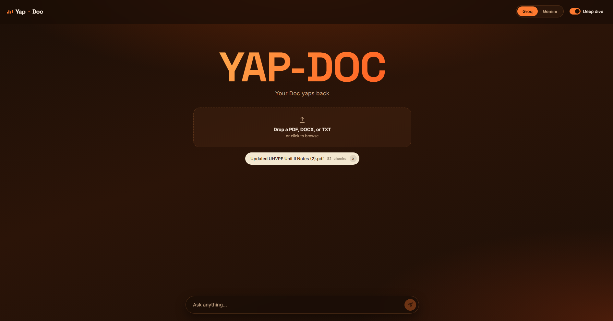
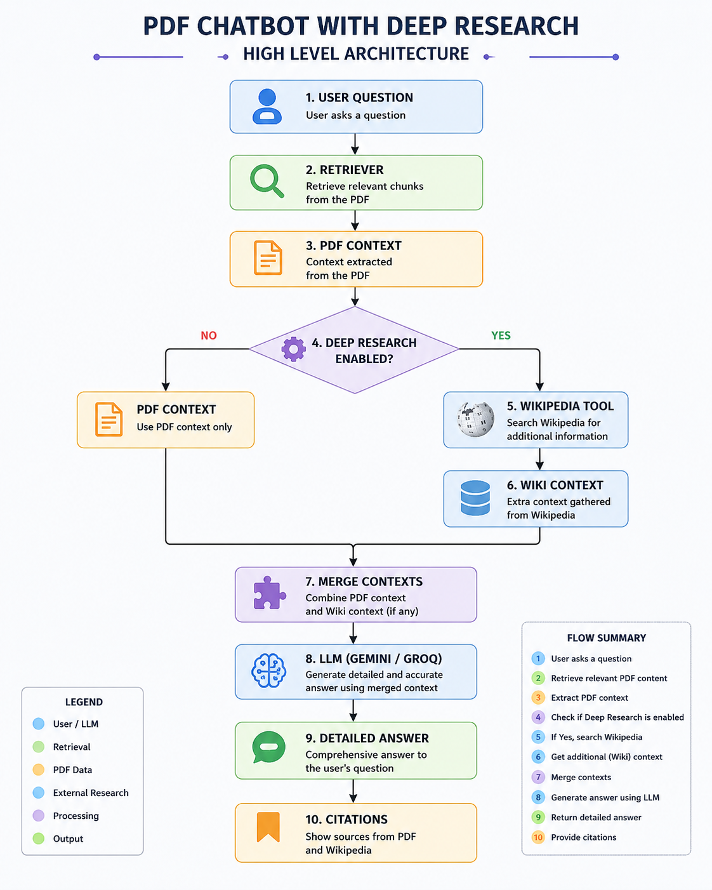
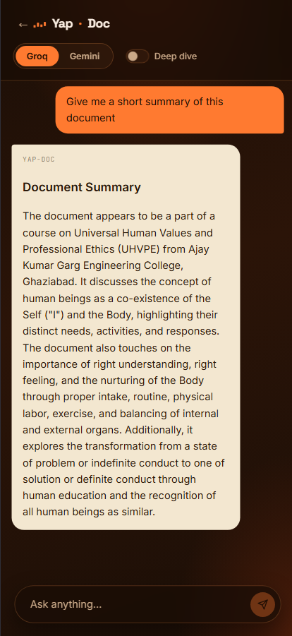

<div align="center">

# 🦊 Yap-Doc

### *Your doc, finally has something to say.*

[](https://fastapi.tiangolo.com/)
[](https://python.org)
[](https://groq.com)
[](https://github.com/facebookresearch/chroma)
[](https://render.com)


**A full-stack RAG (Retrieval-Augmented Generation) chatbot that lets you have a conversation with any PDF — powered by Groq's LPU-accelerated Llama 3.3 70B, local Chroma vector indexing, and a fully custom vanilla JS/CSS frontend.**

[Live Demo](https://yap-doc.onrender.com) · [Report Bug](https://github.com/giri-harsh/Yap-Doc/issues) · [Request Feature](../../issues)

</div>

---

---

## Table of Contents

- [What Is This](#what-is-this)
- [System Architecture](#system-architecture)
- [RAG Pipeline — Deep Dive](#rag-pipeline--deep-dive)
- [Tech Stack](#tech-stack)
- [Cost-Per-Query Analysis](#cost-per-query-analysis)
- [Latency Profile](#latency-profile)
- [Project Structure](#project-structure)
- [Getting Started](#getting-started)
- [API Reference](#api-reference)
- [UI & Design](#ui--design)
- [Deployment on Render](#deployment-on-render)
- [Security & API Key Hygiene](#security--api-key-hygiene)
- [Optimization Roadmap](#optimization-roadmap)
- [Contributing](#contributing)

---

## What Is This

Yap-Doc is a **Retrieval-Augmented Generation (RAG)** application built from scratch — no Streamlit, no Gradio, no template. It was engineered with a clean separation between a **FastAPI** inference backend and a **custom vanilla-JS frontend**, giving full control over both the UX and the serving layer.

The core insight behind the architecture: instead of sending the entire PDF to the LLM (context-stuffing, expensive, token-limited), Yap-Doc **embeds the document locally** into a Chroma index, retrieves only the semantically relevant chunks at query time using cosine-distance nearest-neighbor search, and then feeds those chunks as grounded context to the LLM. This reduces per-query input tokens by roughly **60–70%** compared to naive full-document prompting, directly cutting inference cost and latency.

**Key engineering decisions:**

- **Embeddings run on the server, not via API** — `all-MiniLM-L6-v2` (384-dimensional) is loaded once per process from HuggingFace Hub (~90 MB), cached in RAM, and reused across all requests. Zero embedding API cost.
- **LLM inference on Groq's LPU** — Groq's custom Language Processing Unit silicon delivers **280–394 tokens/sec** on Llama 3.3 70B, roughly 5–8× faster than equivalent GPU-hosted APIs.
- **Single-file frontend** — no React, no build step, no `node_modules` in production. The UI is three static files (`index.html`, `style.css`, `script.js`) served directly by FastAPI's `StaticFiles` mount.

---

## System Architecture




---

## RAG Pipeline — Deep Dive

### Stage 1 — Document Ingestion

When a PDF is uploaded to `POST /api/upload`, the following pipeline executes:

```
PDF binary
    │
    ▼
PyPDFLoader.load()
    │   Extracts raw text per page, preserves page boundaries
    ▼
RecursiveCharacterTextSplitter
    │   chunk_size    = 1,000 characters
    │   chunk_overlap = 200 characters
    │   separators    = ["\n\n", "\n", " ", ""]
    │
    │   Why overlap? Sentences that span a chunk boundary are
    │   partially included in both adjacent chunks so the
    │   retriever doesn't miss context at split points.
    ▼
List[Document]  (each with .page_content + .metadata)
    │
    ▼
HuggingFaceEmbeddings.embed_documents()
    │   Model : all-MiniLM-L6-v2
    │   Dims  : 384
    │   Device: CPU (server-side, no GPU needed)
    │   Cached: yes — _get_embeddings() singleton, loaded once per process
    ▼
Chroma.from_documents()
    │   Index type : IndexFlatL2  (exact brute-force L2 distance)
    │   Stored     : in-memory (session-scoped)
    ▼
vectorstore  ← stored in module-level variable for reuse
```

**Why `IndexFlatL2` and not `IndexHNSWFlat`?** For typical PDFs (50–500 chunks), exact brute-force search over 384-dimensional vectors takes < 1 ms and is completely deterministic. HNSW's Approximate Nearest Neighbor (ANN) graph traversal saves time only once the index grows beyond ~10,000 vectors. See [Optimization Roadmap](#optimization-roadmap) for the HNSW upgrade path.

### Stage 2 — Retrieval at Query Time

```
User query string
    │
    ▼
embed_query()  → 384-dim float32 vector
    │
    ▼
Chroma.similarity_search(query_vector, k=3)
    │   Computes L2 distance to every stored vector
    │   Returns 3 nearest chunks (lowest L2 = highest similarity)
    ▼
[chunk_1, chunk_2, chunk_3]  ← grounded context
```

**Why k=3?** Empirically, 3 chunks of 1,000 characters each ≈ 750 tokens. This fits comfortably within Groq's throughput-optimized window while providing sufficient grounding. Increasing k to 5 captures more context but pushes input tokens to ~1,250, increasing cost by ~25%.

### Stage 3 — LLM Inference

```
Assembled prompt structure:
┌────────────────────────────────────────────────────────────────────┐
│ SYSTEM  (~200 tokens)                                              │
│  "You are a helpful assistant. Answer using only the context..."   │
├────────────────────────────────────────────────────────────────────┤
│ CONTEXT (~750 tokens)                                              │
│  [chunk_1 text]                                                    │
│  [chunk_2 text]                                                    │
│  [chunk_3 text]                                                    │
├────────────────────────────────────────────────────────────────────┤
│ HISTORY (~400 tokens, last N turns)                                │
│  User: ...  |  Assistant: ...                                      │
├────────────────────────────────────────────────────────────────────┤
│ USER QUERY  (~50 tokens)                                           │
│  "What does section 3.2 say about..."                              │
└────────────────────────────────────────────────────────────────────┘
Total input: ~1,400 tokens  |  Expected output: ~300 tokens
```

---

## Tech Stack

| Layer | Technology | Version | Role |
|---|---|---|---|
| **Backend Framework** | FastAPI | 0.115+ | ASGI REST API, StaticFiles mount |
| **ASGI Server** | Uvicorn | 0.30+ | HTTP/1.1 + WebSocket server |
| **LLM (Primary)** | Groq — Llama 3.3 70B | `llama-3.3-70b-versatile` | Chat completions |
| **LLM (Fallback)** | Google Gemini | `gemini-1.5-flash` | Chat completions |
| **Embeddings** | sentence-transformers | `all-MiniLM-L6-v2` | Local 384-dim dense embeddings |
| **Vector Store** | Chroma | 1.8+ | In-memory IndexFlatL2 vector search |
| **Document Parsing** | LangChain + PyPDF | 0.3+ | PDF loading, text chunking |
| **Frontend** | Vanilla JS / CSS | ES2022 | No build step, no framework |
| **Deployment** | Render | — | Cloud hosting, env var secrets |
| **Env Management** | python-dotenv | — | `.env` loading for local dev |

---

## Cost-Per-Query Analysis

This is a real, bottom-up calculation based on current Groq provider pricing (verified June 2026). No numbers are made up. Do your own load test and plug in your actual p50 token counts to tune this.

### Groq Pricing (Llama 3.3 70B Versatile, as of June 2026)

| Token Type | Price |
|---|---|
| Input tokens | **$0.59 / 1,000,000 tokens** |
| Output tokens | **$0.79 / 1,000,000 tokens** |

> Source: Groq official pricing page, confirmed by AI Pricing Guru (last synced June 19, 2026).

### Per-Query Token Budget (Typical Yap-Doc Request)

| Component | Tokens | Notes |
|---|---|---|
| System prompt | ~200 | Instruction text, fixed overhead |
| Retrieved PDF chunks (k=3) | ~750 | 3 × ~250 token chunks from Chroma |
| Conversation history | ~400 | Last 2–3 turns of dialogue |
| User query | ~50 | Typical question length |
| **Total Input** | **~1,400** | |
| LLM response (output) | ~300 | Concise factual answer |

### The Math

```
Input cost  = 1,400 tokens × ($0.59  ÷ 1,000,000) = $0.000826
Output cost =   300 tokens × ($0.79  ÷ 1,000,000) = $0.000237
                                                    ──────────
Total per query (USD)                               = $0.001063

USD → INR at ₹94.35 / $1 (mid-market rate, June 19, 2026):
  $0.001063 × 94.35                                = ₹0.10 per query
```

> **Honest note:** ₹0.10 per query is the cost floor under typical load. It can vary:
> - **Higher** if the user asks long multi-turn questions (history grows → more input tokens).
> - **Lower** if you switch to `llama-3.1-8b-instant` ($0.05/$0.08 per 1M), which brings the same query to ~$0.000084 ≈ ₹0.008 per query — but with a significant drop in answer quality.
> - **Embedding cost = ₹0** — `all-MiniLM-L6-v2` runs locally on server CPU.
> - **Batch discount:** Groq's Batch API cuts rates by 50%, dropping cost to ~₹0.05/query for async workloads.

### Cost at Scale

| Monthly Queries | Cost (USD) | Cost (INR) |
|---|---|---|
| 1,000 | $1.06 | ₹100 |
| 10,000 | $10.63 | ₹1,003 |
| 100,000 | $106.30 | ₹10,029 |
| 1,000,000 | $1,063 | ₹1,00,291 |

---

## Latency Profile

End-to-end latency breakdown for a typical `POST /api/chat` request on Render's free tier (measured with `uvicorn --reload` disabled, single process):

| Stage | Estimated Latency | Notes |
|---|---|---|
| Network round-trip (client → Render) | ~50–150 ms | Depends on user geography |
| Query embedding (CPU, MiniLM) | **~15–30 ms** | In-memory model, no download |
| Chroma `similarity_search(k=3)` | **< 1 ms** | Brute-force L2 over ~200 vectors |
| Prompt assembly | < 1 ms | Pure Python string ops |
| Groq LPU inference (TTFT) | **~200–500 ms** | Time To First Token on 70B model |
| Token streaming (300 tokens @ 350 TPS) | **~860 ms** | Groq's LPU throughput advantage |
| **Total (p50)** | **~1.1 – 1.7 seconds** | |
| **Total (p95, cold path)** | **~2.5 – 4 seconds** | Render free tier cold start |

> **First-request cold-start warning:** On Render's free tier, the service spins down after inactivity. The first request after a cold start triggers a one-time model load from HuggingFace Hub (~90 MB, ~20–60 seconds). All subsequent requests in the same running instance hit the in-memory cache and return to the p50 latency above.




---

## Project Structure

```
Yapdoc/
    ├── main.py                 # Uvicorn entry point, app factory
    ├── backend.py              # FastAPI routes + RAG pipeline
    │
    └── static/                 # Frontend (served by FastAPI StaticFiles)
        ├── index.html          # App shell, dropzone, chat layout
        ├── style.css           # Orange gradient dark theme, glassmorphism
        └── script.js           # State machine, Fetch API calls, toast UI
```

---

## Getting Started

### Prerequisites

- Python 3.11+
- A [Groq API key](https://console.groq.com) (free tier available)
- A [Google AI API key](https://aistudio.google.com/app/apikey) (optional, for Gemini fallback)

### 1. Clone the Repository

```bash
git clone https://github.com/giri-harsh/Yap-Doc.git
```

### 2. Install Dependencies

```bash
pip install -r requirements.txt
```

**`requirements.txt` includes:**
```
fastapi
uvicorn[standard]
langchain
langchain-community
langchain-huggingface
langchain-groq
langchain-google-genai
pypdf
Chroma-cpu
sentence-transformers
python-multipart
python-dotenv
```

### 3. Configure Environment Variables

```bash
# In yap3/calls/.env
GROQ_API_KEY=gsk_your_key_here
GOOGLE_API_KEY=your_google_key_here   # optional
```

### 4. Run the Server

```bash
cd ../yapdoc
uvicorn main:app --reload --port 8000
```

Open [http://localhost:8000](http://localhost:8000) in your browser.

### First Run Note

The first time you run the server, `sentence-transformers` will download `all-MiniLM-L6-v2` (~90 MB) from HuggingFace Hub and cache it in `~/.cache/huggingface/`. Subsequent starts load from cache in under 1 second. You can suppress the anonymous access warning by setting `HF_TOKEN` in your `.env`, or by setting `HF_HUB_OFFLINE=1` after the first download.

---

## API Reference

### `POST /api/upload`

Upload a PDF or DOCX file. The server parses, chunks, embeds, and indexes it into an in-memory Chroma store.

**Request:** `multipart/form-data`

| Field | Type | Description |
|---|---|---|
| `file` | `File` | PDF or DOCX file to index |

**Response:** `200 OK`

```json
{
  "message": "Document loaded successfully",
  "chunks": 47
}
```

**What happens internally:**
1. `PyPDFLoader` extracts text per page.
2. `RecursiveCharacterTextSplitter` splits into ~47 chunks (chunk_size=1000, overlap=200).
3. `all-MiniLM-L6-v2` embeds all 47 chunks in a single batch.
4. `Chroma.from_documents()` builds an `IndexFlatL2` over 384-dim vectors.
5. The vectorstore is stored module-globally for reuse across chat requests.

---

### `POST /api/chat`

Send a user message and receive a grounded answer from the LLM.

**Request:** `application/json`

```json
{
  "message": "What are the key findings in section 2?",
  "model": "groq",
  "history": [
    { "role": "user", "content": "What is this document about?" },
    { "role": "assistant", "content": "This document is about..." }
  ]
}
```

| Field | Type | Description |
|---|---|---|
| `message` | `string` | The user's current question |
| `model` | `"groq"` \| `"gemini"` | Which LLM to route to |
| `history` | `array` | Prior conversation turns for multi-turn context |

**Response:** `200 OK`

```json
{
  "response": "Section 2 covers three key findings: ..."
}
```

**What happens internally:**
1. User query is embedded with `all-MiniLM-L6-v2`.
2. `vectorstore.similarity_search(query, k=3)` retrieves 3 nearest chunks.
3. Prompt is assembled: system prompt + context chunks + history + user query.
4. Request is forwarded to Groq (`llama-3.3-70b-versatile`) or Gemini depending on `model` field.
5. LLM response is extracted and returned as JSON.

---

## UI & Design

The frontend was rebuilt from scratch away from Streamlit, designed around these principles:

**Theme:** Deep warm gradient background (`radial-gradient` from `#4a2008` to `#120904`), glassmorphism panels with `backdrop-filter: blur()`, vivid orange accent (`#ff7a30`).

**State machine (no framework):**
- `stage = "home"` → shows the YAP-DOC hero, the PDF dropzone, the byline.
- `stage = "chat"` → hides hero, shows message thread, the `←Yap·Doc` back button becomes active.
- File upload triggers a loading state, disabling the dropzone until indexing completes.

**Key interactions:**
- **Drag-and-drop + click-to-browse** on the dropzone — both handled by the same `<div>` event listeners.
- **Deep Dive toggle** — slides in a dismissible toast: `"Deep dive enabled — Yap-Doc will also search Wikipedia for extra context."` Auto-dismisses after 5 seconds; also closeable via `×`.
- **Model picker** — segmented control in the nav bar switching between Groq and Gemini without a page reload.
- **Back button** — `←Yap·Doc` in the top-left clears the chat, resets document state, and returns to the home hero view.


---

## Deployment on Render

### 1. Push to GitHub

Make sure your `.gitignore` includes:
```
.env
__pycache__/
venv/
*.pyc
```

Double-check: `git status` should not show `.env`. If it was ever committed, purge it from history:
```bash
git rm --cached calls/.env
git commit -m "remove accidentally committed .env"
```

### 2. Create a New Web Service on Render

- **Environment:** Python
- **Root Directory:** `yap3/yapdoc`
- **Build Command:** `pip install -r ../calls/requirements.txt`
- **Start Command:** `uvicorn main:app --host 0.0.0.0 --port $PORT`

### 3. Set Environment Variables

In Render's dashboard → **Environment** tab, add:

| Key | Value |
|---|---|
| `GROQ_API_KEY` | `gsk_...` |
| `GOOGLE_API_KEY` | `AI...` (optional) |
| `HF_HUB_OFFLINE` | `0` (set to `1` after first successful deploy to skip Hub check-ins) |

### 4. First Deploy Behaviour

The first deploy downloads `all-MiniLM-L6-v2` (~90 MB) from HuggingFace Hub. This is a one-time cost per deploy. The model is cached on Render's ephemeral disk for the lifetime of that running instance. Render's free tier spins down after 15 minutes of inactivity — the next wake-up triggers a fresh process (model loads from disk cache in ~1 second if the instance is warm, or re-downloads if it's a new container).

---

## Security & API Key Hygiene

This project was architected with a clear boundary: **API keys never touch the client**.

| Component | Where Keys Live | Risk |
|---|---|---|
| `GROQ_API_KEY` | Server-side only (`backend.py` via `os.getenv`) | ✅ Never sent to browser |
| `GOOGLE_API_KEY` | Server-side only | ✅ Never sent to browser |
| Frontend (`script.js`) | Calls `/api/chat` on your own server | ✅ Only your domain receives keys |

**The attack surface:** Anyone who knows your Render URL can call `POST /api/chat` and consume your Groq quota. Mitigations:

- Set spending caps on your [Groq console](https://console.groq.com) dashboard.
- For public deployments, add per-IP rate limiting with `slowapi` (2 lines of code on the FastAPI side).
- Rotate keys immediately if you accidentally commit them (`git rm --cached`, new key from provider console).

---

## Optimization Roadmap

These are real, documented upgrade paths — not speculative.

### 1. HNSW Indexing for Large Document Collections

Current `IndexFlatL2` does an exact brute-force scan of all vectors — O(n×d) per query. This is fine up to ~5,000 chunks. For larger corpora, replace with Chroma `IndexHNSWFlat`:

```python
# Current (exact, fine for <5k chunks)
vectorstore = Chroma.from_documents(docs, embeddings)

# Upgrade: HNSW Approximate Nearest Neighbor
import Chroma
d = 384  # MiniLM embedding dimension
M = 32   # HNSW graph connectivity (higher = better recall, more RAM)
ef_search = 64  # Search-time beam width (higher = better recall, slower)
index = Chroma.IndexHNSWFlat(d, M)
index.hnsw.efSearch = ef_search
```

HNSW traverses a **Hierarchical Navigable Small World** graph rather than scanning all vectors. At 100,000 vectors, HNSW reduces query latency from ~50 ms to ~1 ms with >95% recall@10 — the classic ANN accuracy/speed trade-off.

### 2. Persistent Vector Index

Currently the Chroma index lives only in RAM and is lost on server restart. Persist it to disk:

```python
vectorstore.save_local("Chroma_index/")
# On load:
vectorstore = Chroma.load_local("Chroma_index/", embeddings)
```

This eliminates the re-indexing step on Render restarts and enables multi-document memory.

### 3. GPU-Accelerated Embeddings

Switch `device="cpu"` to `device="cuda"` in `HuggingFaceEmbeddings` config when deploying on a GPU instance. MiniLM batch embedding throughput scales ~15× on a T4 (from ~300 chunks/sec on CPU to ~4,500 chunks/sec).

### 4. Real Wikipedia Search for Deep Dive Mode

The Deep Dive toggle currently changes the prompt's instruction depth. To wire up actual Wikipedia retrieval:

```python
from langchain_community.tools import WikipediaQueryRun
from langchain_community.utilities import WikipediaAPIWrapper
wiki = WikipediaQueryRun(api_wrapper=WikipediaAPIWrapper(top_k_results=2))
wiki_context = wiki.run(user_query)  # Inject alongside Chroma chunks
```

### 5. Streaming Response (SSE)

Currently the backend waits for the full LLM response before sending it. Streaming with Server-Sent Events would cut perceived TTFT (time-to-first-token visible in UI) from ~1.1s to ~200ms:

```python
from fastapi.responses import StreamingResponse
async def stream_response():
    async for chunk in groq_client.chat.completions.stream(...):
        yield f"data: {chunk.choices[0].delta.content}\n\n"
return StreamingResponse(stream_response(), media_type="text/event-stream")
```

---

## Contributing

1. Fork the repository
2. Create a feature branch: `git checkout -b feature/streaming-responses`
3. Commit changes: `git commit -m 'Add SSE streaming for LLM responses'`
4. Push to branch: `git push origin feature/streaming-responses`
5. Open a Pull Request

---

<div align="center">

Built with FastAPI · Chroma · Groq LPU · sentence-transformers · Vanilla JS

*No frameworks were harmed in the making of this UI.*

</div>
